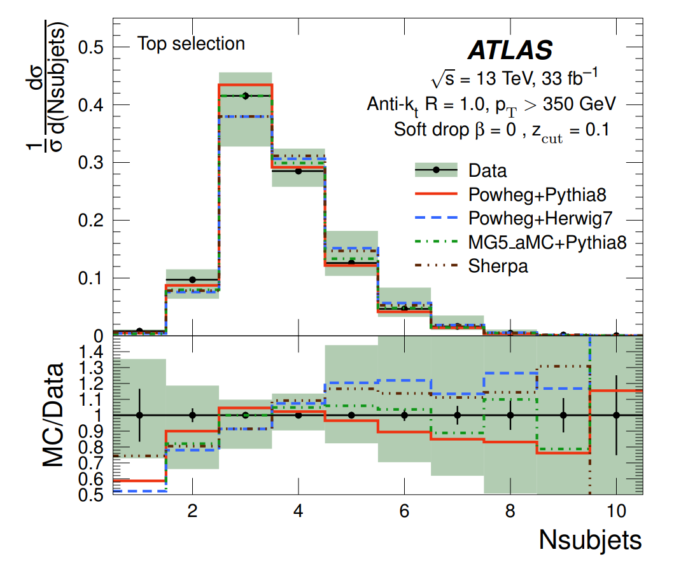
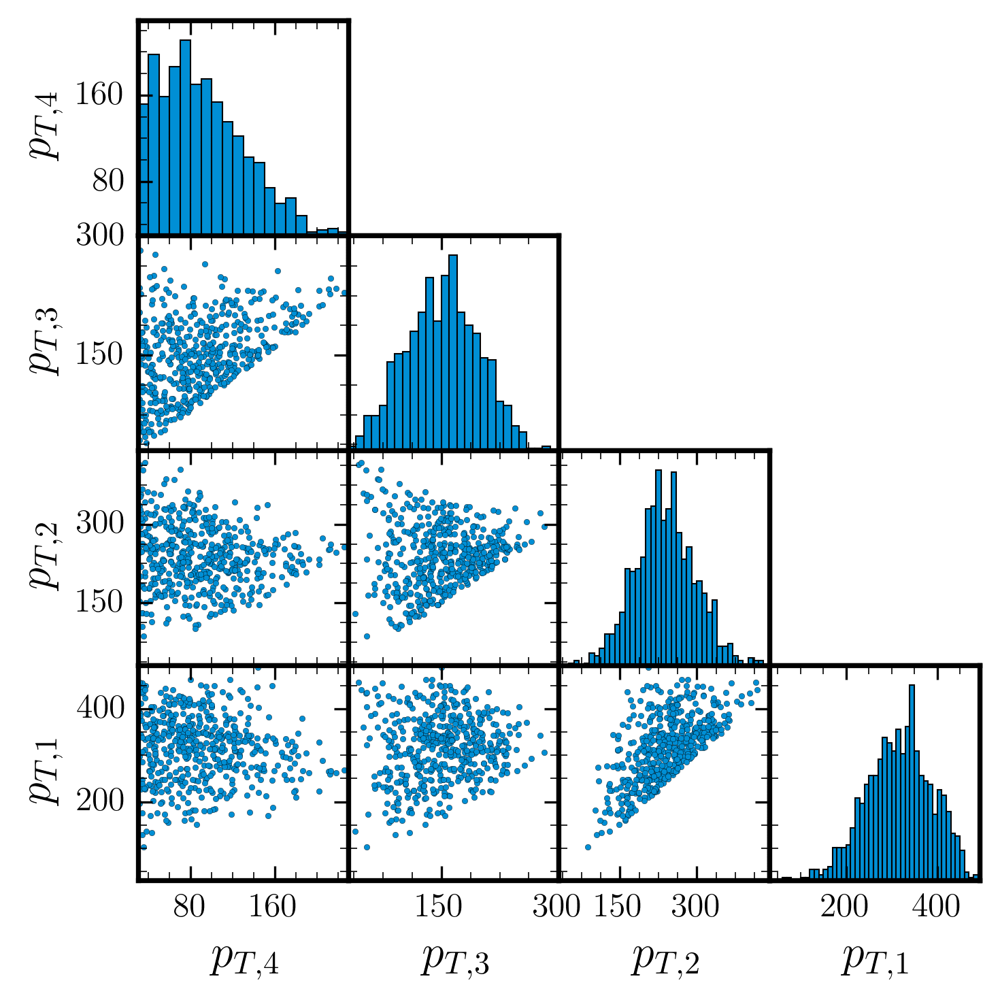

<!--  -->

<!-- _class: titlepage -->

# Evidence is all you need
## Nested Sampling for Particle Physics
### David Yallup (<dy297@cam.ac.uk>)
#### 24th Feb 2023
##### UCL HEP seminars

 
[yallup.github.io/ucl_hep]

---
# Backstory

&nbsp;

2015-2019, HEP @ UCL, PhD. with Prof. Butterworth
> Formerly ATLAS collaboration, although more time spent on MCnet activities, Herwig and Rivet/Contur

&nbsp;
Since 2021 PDRA in KICC, Cambridge. w. Dr Handley and Prof. Hobson
> Knowledge transfer from Cosmo to industry, Sampling and inference 

---

<!-- paginate: true -->

# HEP related work

Technical developments:

__MultiNest__ [[0809.3437]](https://arxiv.org/abs/0809.3437)
__Polychord__ [[1506.00171]](https://arxiv.org/abs/1506.00171)

Analysis:

SuperBayes [[0809.3792]](https://arxiv.org/abs/0809.3792)
Gambit [[1705.07908]](https://arxiv.org/abs/1705.07908)
Various parameter scanning [[2101.04525]](https://arxiv.org/abs/2101.04525)
Phase Space Nested sampling [[2205.02030]](https://arxiv.org/abs/2205.02030)

----

# Bumphunting

Perhaps most poured over, developed, inference task in Particle Physics

Today Presenting work by DY and Will Handley: 
__"Hunting for Bumps in the Margins"__ [[2211.10391]](https://arxiv.org/abs/2211.10391)

----

## Goals for today: Extract the signal from the noise

Physics goal:

* 1. The signal __(higgs)__ from the noise __(background process)__

* 2. Promote Bayesian inference for HEP

Personal goals:

* 1. The signal __(Why we use Nested Sampling so much in cosmology)__ from the noise __(Bayesian vs Frequentist debate)__

* 2. I made some neat animations I want to show off

----
# Agenda

1. Set up some terminology
2. Why be Bayesian?
3. Diphotons and fitting in HEP
4. What did we learn?

5. Bonus: _More general ML ideas_

----

<!-- _class: invert lead -->

# Set up some terminology
(Hopefully) demystifying some jargon

---

#### Terminology crib sheet

##### Model (choice)

$f(x,A)=Ae^{-x}$ or $f(x,A)=Ax^{- 2}$?

#### Prior

What values of $A$ make sense?

##### (log) Likelihood

$$
\mathcal{L}(n_i \lvert A) = \prod_i  f(x_i,A)^{n_i} \frac{e^{-f(x_i,A)}}{n_i!}
$$

__Either__: Find the $A$ that maximises $\mathcal{L}$, ML estimator ($\hat{A}$), __Or__ find the distribution of $A$, $P(A \lvert n_i)$

---

### Bayes Rule
<!--  -->

$$ \mathrm{Posterior} = \frac{\mathrm{Likelihood}\times \mathrm{Prior}}{\mathrm{Evidence}}\, $$

$$ P(\theta | X) = \frac{\mathcal{L}(X | \theta)\times \Pi(\theta) }{Z}\, $$

  >  __Evidence:__ $Z = \int d\theta \mathcal{L}(X | \theta) \Pi(\theta)$

#### Often written as
  $$ P(\theta | X) = \frac{P(X | \theta)\times P(\theta) }{P(X)}\, $$

Definition of conditional probability

> Claim: If you can calculate Z you have everything you want to know

---

<!-- _class: invert lead -->

# Bayesian Techniques
A brief look at their role in Particle Physics
An introduction to Nested Sampling

----
<!-- _class:  lead -->

<centre>

</centre>

---

----

<!-- _class:  lead -->

### Confidence levels do not reflect degrees of belief

### Credibility intervals do not guarantee coverage

### Use the best tool from the relevant toolboxes for the job at hand

* __This always seems weak to me! I will try and convince you there is clearly definable merit to Bayesian thinking__

----

# Why be Bayesian in Particle Physics?

## __For__

* Prominence in adjacent fields

* Simplifying framework 

* Often more principled 

* Can ask new questions

<!-- 
What most people think of
$$P(\Phi ) \propto \mathcal{L}(\Phi) \Pi (\Phi) $$

Not strictly an integral problem -->

## __Against__

* Tried and found wanting

* Conceptual difficulties

* Computational challenges

* Forces you to ask different questions

---

<!-- ### Why Be Bayesian in Particle Physics: Call and response

* _You're just shuffling the deck_
  * __I will try and identify things we can uniquely assess__

* _We've tried it all before_
  * __I will try and argue for an _Evidence_ first approach__

* _All very well in theory, but in practice often unfeasible_
  * __I will try and argue that the caveats to frequentist techniques often amount to the Bayesian equivalent__

---- -->

## A historic debate

* [[1st PhyStat workshop, 2000]](https://cds.cern.ch/record/411537/files/CERN-2000-005.pdf)

  Talk of Peter Clifford (Mathematical statistician, PhD student of Neyman)

* _"Well, maybe I didn’t spell it out, but before I came here I assumed that all physicists were Bayesians. Physicists are interested in induction, they want to modify their beliefs about the true state of nature on the basis of the data that they’ve observed. When you are busy __integrating out parameters, in a sense, you keep slipping into a Bayesian mode of operating__"_

<!-- &nbsp;
A potential aside on 5$\sigma$ -->

<!-- _"If you’re in a situation with high prior sensitivity, where the data is really not telling you a whole lot, then that’s an important piece of information too"_ -->

* ### Is HEP exceptional (compared to Bayesian dominated fundamental physics fields e.g. Cosmology?) Or have we missed a trick?

----
### A historic debate - troubling reading?

Peter Clifford, cont.

_Early statisticians saw benefits in devising simple rules for testing the null hypothesis...__“time is precious – analyse the data and move on to the next client”__. The statistician’s perspective was made explicit by Neyman._
... 
_Neyman’s advice was to control the frequency of Type I error within this ensemble. __In other words, in your career as a statistician, arrange that the frequency of rejecting null hypotheses incorrectly is no more than, say, 5%.___

----

### A historic debate $-$ Hypothesis testing

A lot of ink spilled about this topic, my 2c,

* __Particle:__ Comparing $H_\mathrm{SM}$ to $H_\mathrm{SM+BSM}$ - strong prior beliefs overpower likelihoods
  * $\rightarrow$ Bayesian belief quantification perhaps not best suited

* __Cosmo:__ "Standard Model" $\Lambda_\mathrm{CDM}$ is an effective theory
  * $\rightarrow$ More analogous to SMEFT

*  In particle we are increasingly asking model comparison questions that move us towards the Cosmo side, see SMEFIT [[2105.00006]](https://arxiv.org/abs/2105.00006)

---

## Pillars of Bayesian inference

$$ P(\theta | X) = \frac{\mathcal{L}(X | \theta)\times \Pi(\theta) }{Z}\, $$

* ### Parameter Inference
  $$P(\theta \lvert X ) \propto \mathcal{L}(X \lvert \theta ) \cdot \Pi (\theta) $$

  What most people think of
  
  Not strictly an integral problem, ergodic time....

* ### _Model Comparison_

  $$\mathcal{Z} = \int d\theta \mathcal{L}(X \lvert \theta ) \cdot \Pi (\theta)  $$

  An "Evidence first" approach, concentrate on issues of model comparison

  Historically HARD

  

----

### Numerical Integration 

----
## Particle physics integrals - Phase space integration

----
## Markov Chain Monte Carlo

Above a certain dimension have to use local guesses (MCMC), failure modes still pronounced

----

## Nested Sampling

Nested Sampling [[Skilling 2006]](https://projecteuclid.org/journals/bayesian-analysis/volume-1/issue-4/Nested-sampling-for-general-Bayesian-computation/10.1214/06-BA127.full), implemented for in PolyChord [[1506.00171]](https://arxiv.org/abs/1506.00171). Is an excellent way to generically approach this problem for $\mathcal{O}(10)\rightarrow \mathcal{O}(100)$ dimensions

__Features__
* Primarily an integral algorithm (largely unique vs other MCMC approaches)
* Designed for multimodal problems from inception 
* Requires construction that can sample under hard likelihood constraint
* Largely self tuning
  * $\rightarrow$ Little interal hyperparameterization
  * $\rightarrow$ More importantly, "tunes" any reasonable prior to posterior

----

### Himmelblau function

$$

f(x) \propto -\exp [(x^2 + y -11)^2 + \\ (x + y^2 -7)^2]

$$

Multimodal function, (exponential of square ~ Gaussian)

Four identical local maxima

----

----

----

### Rastigrin function

$$

f(x) \propto - \sum [x_i^2 - 10 \cos(2\pi x_i)]

$$

An "optimally difficult" problem in 2D

----

----

<!-- _class: invert lead -->

# Diphotons and fitting in HEP
The case for fitting models with MCMC

----

## Toy diphoton model

Fit to background only diphoton data

Generated unknown data from LO QCD diphoton production (Herwig)

Sample realisation of Poission noise data

----
# Likelihoods

$$
\mathcal{L}(n_i \lvert \Theta) = \prod_i  b(x_i,\Theta)^{n_i} \frac{e^{-b(x_i,\Theta)}}{n_i!}
$$

$$
    b(x_i,\Theta) = b(x_i,\theta,N,\phi) = \sum^N_k \phi_k(x_i,\theta)
$$

What we want $P(\theta,N,\phi \lvert n_i)$
What we get out the box with frequentist inference $P(\hat\theta \lvert n_i, N,\phi )$

How do we understand the discrete $\{N,\phi\}$?

----
### Discrete Profiling

Closest analogue, CMS method [[1408.6865]](https://arxiv.org/abs/1408.6865)

ATLAS, Spurious signal tests, not discussed here

Treat each choice of $\{N,\phi\}$ as a discrete model
$\rightarrow$ derive set of individual $P(\hat\theta \lvert n_i)_{\{N,\phi\}}$

## But...

Larger values of $N$ always prefered, have to derive a correction

----

# Discrete Profiling

 

----

# Discrete Profiling

 

----
<!-- _class: invert lead -->

# Discrete Marginalising
## Shopping list:
### Likelihood &#9989; Poisson 
### Models &#9989; Standard Functions
### Priors 	&#8265;
### Recipe to combine	&#8265; -- Just calculate $Z$!

----

### Pick some useful functions (models)

$$
    \phi= \mathrm{exp}:\\   b(x,\theta, N) = \sum_{m=1}^{N_{\mathrm{max}}} \theta_{1,m} \exp (-\theta_{2,m} x)
$$
$$
    \phi= \mathrm{power}: \\  b(x,\theta, N) = \sum_{m=1}^{N_{\mathrm{max}}} \theta_{1,m}  (x+1)^{-1.5\theta_{2,m}}
$$
$$
    \phi= \mathrm{logpoly}: \\  b(x,\theta, N) = \sum_{m=1}^{N_{\mathrm{max}}} \theta_{1,m} \log(x+e)^{-4\theta_{2,m}}

$$

----
## Choose some priors

$$
    b(x_i,\Theta) = b(x_i,\theta,N,\phi) = \sum^N_k \theta_1 \phi_k(x_i,\theta_2)
$$

Basis amplitudes: ___sorted_ Uniform__, $\theta_1 \in  [-10,10]$ 

Basis exponent: __Uniform__, $\theta_2 \in  [0,5]$

Hierarchical params: __Uniform integer__, $N,\phi \in  (1,3)$

$\rightarrow$ assuming *, yields functions like $f(x) = e^{-x} \rightarrow$ smooth constantly decreasing
$f'(x)<0, f''(x) > 0$ $\rightarrow$ desireable inductive bias

----

### Set the heights

Frequentist: $\quad -\mathrm{AIC} = 2 \ln {\hat{\mathcal{L}}} - 2k$
Bayesian: $\quad \ln\mathcal{Z}  = \langle \ln \mathcal{L} \rangle_P - D_\mathrm{KL}$

----
### An optimial correction term

Kullbeck-Leibler divergence:
__Information gain between prior and posterior__

$$
D_\mathrm{KL} = \int d\theta P(\theta) \ln \frac{P(\theta)}{\Pi(\theta)}
$$

Quantifies How far apart the prior and posterior are

----

### Find the probabilities

Frequentist: $\quad \mathcal{L}(N,\phi)_{\mathrm{AIC}}=\exp \bigg( \frac{\mathrm{AIC}_{\mathrm{min}}- \mathrm{AIC}_{N,\phi}}{2} \bigg)$
Bayesian: $\quad P(N,\phi)= \frac{\mathcal{Z}_{N,\phi}}{\sum(\mathcal{Z}_{N,\phi})}$

----

----

----
### Signal model

Generic Gaussian signal "bumphunt"

$$
    H_\psi: \quad  \mathcal{L}(n_i \lvert \Psi,\Theta) = \prod_i \big(s(x_i,\psi) + b(x_i,\Theta)\big)^{n_i}\cdot \frac{e^{-(s(x_i,\psi) +  b(x_i,\Theta))}}{n_i!}
$$

$$
s(x_i,\psi) = s(x_i,A,\mu,\sigma) = A \cdot \mathrm{Normal}(\mu,\sigma) 

$$

Amplitude: __Uniform__ $A \in  [0,500], A_\mathrm{true}=150$
Mean: __Uniform__ $\mu \in  [100,180], \mu_\mathrm{true}=125$
Variance: __Uniform__ $\sigma \in  [0.5,3], \sigma_\mathrm{true}=1$

Narrow width generic signal search

----
### True positive - Type II errors

$$\frac{\mathcal{Z}_\psi}{\mathcal{Z}_0} = \frac{P(H_\Psi)}{P(H_0)}= 9.29 \pm 1.37 $$ 

Interpret as ~9:1 odds of $H_\Psi$ over $H_0$, roughly 90% confidence in $H_\Psi$

_Evidence is all you need_ - Directly calculate the only thing I care about, well calibrated global odds.

----

### Signal parameters

Recover the true (dotted lines) signal parameters

Resolve rich information about the model

* __Discrete:__ Sample over $\{N,\phi\}$

* __Fixed:__ Fix $\{N=2,\phi=\mathrm{exp}\}$

Marginalising discrete parameters greatly improves signal inference

----
### False positives

Arguably more important for unsupervised learning - repeat with no signal injected

$$\frac{\mathcal{Z}_\psi}{\mathcal{Z}_0} = \frac{P(H_\Psi)}{P(H_0)}= 0.59 \pm 0.08 $$ 

Null ~ twice as likely as BSM

NS navigating both multimodal background and signal

----

<!-- _class: invert lead -->

# Presenting some of the competition

## How else can we capture this increased functional diversity?

----

## SWIFT [[cds:2743717]](https://cds.cern.ch/record/2743717?ln=en)

Replace global parametric form with local "sliding window"

__Look Elsewhere Effect__ already a huge problem for this type of task (__more later__), this only exacerbates one of the main problems?

----

## Gaussian Process Regression [[cds:2743717]](https://cds.cern.ch/record/2743717?ln=en)

_"... The most interesting problems, the task of feature discovery for example, are __not__ ones that Gaussian processes will solve_"
__David Mackay - [[Inference]](http://www.inference.org.uk/mackay/itila/)__

_"non-parametric models require the length scale over which the anomaly exhibits to be well separated from the length scale of the background process"_
__[[2211.10391]](https://arxiv.org/abs/2211.10391)__

----

<!-- _class: invert lead -->

# Follow on from this work

Topics I'd like to think about more
Topics I'd be interested in hearing more about

----
## ML anomaly detection 

Renewed interest in leverage ML, beyond the bump hunt [[2101.08320]](https://arxiv.org/abs/2101.08320)

Still often bump hunting (in latent space) $\rightarrow$ excellent candidate for more shape aware (discrete marginal) fitting

A lot of approaches struggle with False positives $\rightarrow$ Bayesian amortization an excellent candidate

----

## Look Elsewhere Effect

$$\frac{\mathcal{Z}_\psi}{\mathcal{Z}_0}= 9.29 \pm 1.37 $$ 

$\rightarrow$ roughly analogous to __global__ 90% confidence in $H_\psi$. Visually this seems low?!

_"significances from our Bayesian framework are typically about $1 – 2\sigma$ smaller than the global significances, ... This suggests that even global significances could significantly overstate the evidence against the background only model."_
[[1902.03243]](https://arxiv.org/abs/1902.03243)

Arbitrary nature of frequentist global p-value is worrying

----

## Dijets and PDFs

Particularly sensitive to modelling in tails, e.g. dijet fit function

$$
f(x) = p_1 (1-x)^{p_2}x^{p_3+p_4\ln x}
$$

Small modelling differences can lead to large variance in parameters.

Less my area but can aspects of PDFs be approached with Bayesian paradigm ($\chi^2$ fits, Hessian approximations etc.)

----
## Soft models

Tuning soft models already noted to be $\sim$ both BSM searches [[professor]](https://professor.hepforge.org/), already preliminarily posed as a Nested Sampling problem

Herwig (Cluster ~10 params) vs Pythia (String ~30 params) an excellent candidate for model comparison with strong dimensional difference

__There is an answer to age old 2 point comparisons in HEP__

----

## Matrix elements

Pose phase space integration as [[2205.02030]](https://arxiv.org/abs/2205.02030)
$$ \sigma = \int\limits_\Omega d\Phi |\mathcal{M}|^2 (\Phi)\, $$
$$ \mathcal{Z} = \int d\theta \mathcal{L} (\theta) \Pi (\theta)\, $$
Explore scale choice as model comparison problem 
__nb:__ ME as Likelihood, __not__ fitting to data

----

<!-- _class: invert lead -->

# Conclusion

#### Fine detail of model comparison problems are (for my money) increasingly coming to the fore of particle physics

#### Bayesian Inference is a natural way to construct model comparison problems

#### Nested Sampling has been demonstrated as indispensable for model comparison without approximations in Cosmology

## Thanks for listening

